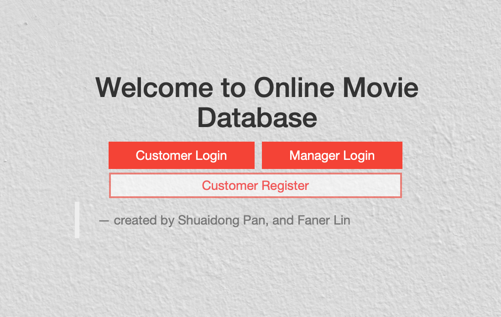

# Online-Movie-Managment-System
An online movie tracking system for DVD stores and DVD seller


The project is desined using Mysql, HTML5/CSS, and PHP.


The sample data could be found in the directory ``load_sql`` and could use the following command in Mysql
```bash
source create.sql
source load.sql
```


The index page is ```starter.html``` which looks like:



